# State Machine Design — Yamada Bee Farm Multi-Agent Voice System

This document covers the current state machine implementation and three proposed production-level alternatives. Each section includes a Mermaid diagram, data structure, and explanation of how it works within the LiveKit multi-agent workflow.

---

## Table of Contents

1. [Current Implementation — Flat Sequential Task List](#1-current-implementation--flat-sequential-task-list)
2. [Option 1 — Hierarchical Task Trees](#2-option-1--hierarchical-task-trees)
3. [Option 2 — Finite State Machine with Transitions (Recommended)](#3-option-2--finite-state-machine-with-transitions-recommended)
4. [Option 3 — Event-Driven Orchestrator](#4-option-3--event-driven-orchestrator)
5. [Comparison Matrix](#5-comparison-matrix)

---

## 1. Current Implementation — Flat Sequential Task List

### How It Works

Each agent has a flat ordered list of tasks stored in `session.userdata["state_machine"]`. Tasks are completed strictly in sequence — the `advance_task()` function only marks a task as completed if it is the **current task**. The next pending task becomes current automatically.

Two completion mechanisms exist:
- **Tool-based tasks**: Auto-completed when the associated tool is called (e.g., `get_session_context` auto-advances `load_context`).
- **Conversational tasks**: The LLM must explicitly call `complete_task(agent_name, task_id)` to mark them done.

The `format_state_machine()` function injects a checklist into every LLM call as a system message, showing `✓` (done), `→` (current), and `○` (pending).

### Data Structure

```python
"subscription": {
    "tasks": [
        {"id": "load_context",        "label": "Load session context",    "status": "pending"},
        {"id": "handle_request",      "label": "Handle request",          "status": "pending"},
        {"id": "record_outcome",      "label": "Record the final outcome","status": "pending"},
        {"id": "check_anything_else", "label": "Ask if anything else",    "status": "pending"},
        {"id": "transfer_out",        "label": "Transfer to finishing",   "status": "pending"},
    ],
    "current_task": "load_context",
}
```

### Mermaid Diagram — Current System (Subscription Agent Example)

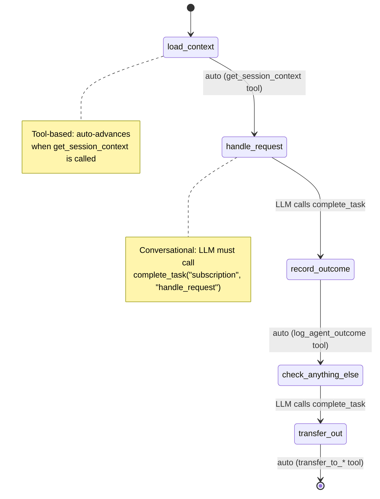

### Mermaid Diagram — Current System (Full Multi-Agent Flow)

```mermaid
stateDiagram-v2
    direction TB

    state "Reception Agent" as reception {
        [*] --> r_greet
        r_greet --> r_verify : complete_task
        r_verify --> r_intent : auto (get_customer_info)
        r_intent --> r_fetch_order : complete_task
        r_fetch_order --> r_fetch_sub : auto (get_order_info)
        r_fetch_sub --> r_prepare : auto (get_regular_info)
        r_prepare --> r_transfer : auto (prepare_handoff_context)
        r_transfer --> [*] : auto (transfer_to_*)
    }

    state "Subscription Agent" as subscription {
        [*] --> s_load
        s_load --> s_handle : auto (get_session_context)
        s_handle --> s_record : complete_task
        s_record --> s_check : auto (log_agent_outcome)
        s_check --> s_transfer : complete_task
        s_transfer --> [*] : auto (transfer_to_*)
    }

    state "Sales Agent" as sales {
        [*] --> sa_load
        sa_load --> sa_present : auto (get_session_context)
        sa_present --> sa_close : complete_task
        sa_close --> sa_log : complete_task
        sa_log --> sa_transfer : auto (log_agent_outcome)
        sa_transfer --> [*] : auto (transfer_to_*)
    }

    state "Support Agent" as support {
        [*] --> su_load
        su_load --> su_diagnose : auto (get_session_context)
        su_diagnose --> su_resolve : complete_task
        su_resolve --> su_log : complete_task
        su_log --> su_transfer : auto (log_agent_outcome)
        su_transfer --> [*] : auto (transfer_to_*)
    }

    state "Decease Handling Agent" as decease {
        [*] --> d_load
        d_load --> d_condolences : auto (get_session_context)
        d_condolences --> d_caller : complete_task
        d_caller --> d_deceased : complete_task
        d_deceased --> d_explain : complete_task
        d_explain --> d_unpaid : complete_task
        d_unpaid --> d_register : complete_task
        d_register --> d_transfer : auto (collect_decease_information)
        d_transfer --> [*] : auto (transfer_to_*)
    }

    state "Finishing Agent" as finishing {
        [*] --> f_load
        f_load --> f_collate : auto (get_session_context)
        f_collate --> f_store : complete_task
        f_store --> f_confirm : auto (store_user_req)
        f_confirm --> f_followup : complete_task
        f_followup --> f_close : complete_task
        f_close --> [*] : complete_task
    }

    reception --> subscription : transfer_to_subscription
    reception --> sales : transfer_to_sales
    reception --> support : transfer_to_support
    reception --> decease : transfer_to_decease_handling
    subscription --> finishing : transfer_to_finishing
    sales --> finishing : transfer_to_finishing
    support --> finishing : transfer_to_finishing
    decease --> finishing : transfer_to_finishing
    finishing --> sales : transfer_to_sales (new request)
    finishing --> subscription : transfer_to_subscription (new request)
    finishing --> support : transfer_to_support (new request)
```

### Limitations

| Limitation | Impact |
|---|---|
| **No branching** | `handle_request` covers cancellation, changes, and escalation — all as one opaque step. The state machine can't enforce different flows for different intents. |
| **No loops** | If the customer says "actually I have another subscription question" after `check_anything_else`, the only option is `reset_agent_tasks()` which resets ALL tasks, losing progress. |
| **No nesting** | Retention (3 attempts) lives inside `handle_request` with no visibility to the state machine. The LLM manages retry counting on its own. |
| **LLM-dependent completion** | Conversational tasks rely on the LLM calling `complete_task`. If it forgets, the gate blocks forever. If it calls it prematurely, tasks get skipped. |
| **No conditional transitions** | Every task always leads to the next one in the list. There's no way to skip `record_outcome` if the customer was transferred to another agent mid-flow. |

---

## 2. Option 1 — Hierarchical Task Trees

### How It Works

Same dict-based approach, but tasks can have `children` (sub-tasks) and a `repeat` flag. The `advance_task()` function walks depth-first: it completes the current leaf node, moves to the next sibling, and when all children are done, the parent auto-completes.

`repeat: True` on a parent means that subtree can be reset independently without touching the rest of the agent's tasks. This handles "anything else?" loops cleanly.

Optional `condition` strings on tasks allow skipping (e.g., retention tasks only activate if intent is cancellation). The condition is evaluated against session context.

### Data Structure

```python
"subscription": {
    "current_path": ["handle_request", "understand_request"],  # depth-first pointer
    "tasks": [
        {
            "id": "load_context",
            "label": "Load session context",
            "status": "pending",
            "auto_tool": "get_session_context",
        },
        {
            "id": "handle_request",
            "label": "Handle subscription request",
            "status": "pending",
            "repeat": True,
            "children": [
                {
                    "id": "understand_request",
                    "label": "Clarify the request type",
                    "status": "pending",
                },
                {
                    "id": "retention",
                    "label": "Retention flow",
                    "status": "pending",
                    "condition": "intent == cancel",
                    "children": [
                        {"id": "retention_1", "label": "Attempt 1: solve problem",   "status": "pending"},
                        {"id": "retention_2", "label": "Attempt 2: make it personal","status": "pending"},
                        {"id": "retention_3", "label": "Attempt 3: show you care",   "status": "pending"},
                    ],
                },
                {
                    "id": "record_change",
                    "label": "Record the outcome",
                    "status": "pending",
                    "auto_tool": "log_agent_outcome",
                },
            ],
        },
        {
            "id": "check_anything_else",
            "label": "Ask if anything else",
            "status": "pending",
            "transitions": {
                "yes": "handle_request",  # re-enter the repeatable subtree
                "no": "transfer_out",
            },
        },
        {
            "id": "transfer_out",
            "label": "Transfer to finishing",
            "status": "pending",
            "auto_tool": "transfer_to_finishing",
        },
    ],
}
```

### Mermaid Diagram — Hierarchical Task Tree (Subscription Agent)

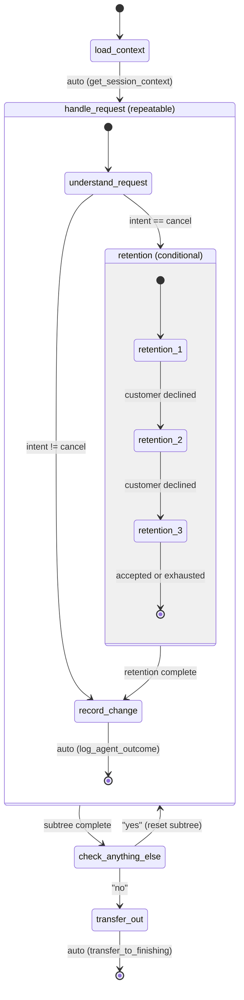

### Mermaid Diagram — Hierarchical Task Tree (Reception Agent)

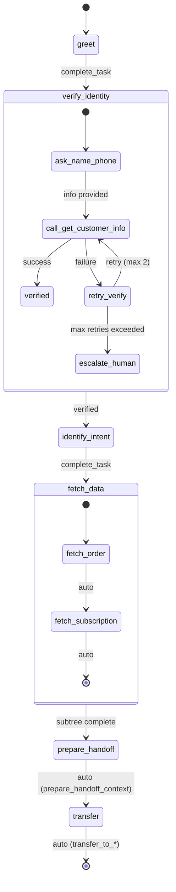

### How advance_task Works (Depth-First)

```
Current path: ["handle_request", "retention", "retention_1"]

1. Mark retention_1 as ✓
2. Next sibling of retention_1 → retention_2
3. New path: ["handle_request", "retention", "retention_2"]

When retention_3 completes:
1. Mark retention_3 as ✓
2. No more siblings → parent "retention" auto-completes ✓
3. Next sibling of retention → record_change
4. New path: ["handle_request", "record_change"]

When record_change completes:
1. Mark record_change as ✓
2. No more siblings → parent "handle_request" auto-completes ✓
3. Next top-level task → check_anything_else
4. New path: ["check_anything_else"]
```

### Pros & Cons

| Pros | Cons |
|---|---|
| Minimal refactor from current system | Condition strings (`"intent == cancel"`) are fragile — need an eval mechanism |
| LLM prompt format barely changes (still a checklist, just indented) | Tree traversal logic is more complex than flat list |
| Nesting gives visibility into retention attempts | Still not a full graph — can't express arbitrary transitions |
| `repeat` flag handles "anything else?" loops cleanly | Deep nesting can make the injected prompt verbose |

---

## 3. Option 2 — Finite State Machine with Transitions (Recommended)

### How It Works

Replace the task list with a proper state graph. Each agent defines a set of **states** and **transitions**. The current state is tracked, and movement between states happens via **events** — either emitted by tool calls automatically or by the LLM calling a `transition()` function.

Key concepts:
- **States** are named nodes (not ordered tasks). Each state can have `auto_tool` (auto-transition when a tool is called), `transitions` (event → next state mapping), or `on_complete` (default next state).
- **Events** are strings like `"cancel"`, `"retained"`, `"yes"`, `"no"`. They drive transitions.
- **Bounded retries** via `max_attempts` on a state. When attempts are exhausted, the `"exhausted"` event fires automatically.
- **Loops** are first-class: `check_anything_else → yes → understand_request` is a real cycle.
- **Terminal states** end the agent's flow.

The LLM prompt injection shows only the current state and available transitions — much simpler than a full checklist.

### Data Structure

```python
"subscription": {
    "current_state": "load_context",
    "history": [],  # audit trail of state transitions
    "states": {
        "load_context": {
            "label": "Load session context",
            "auto_tool": "get_session_context",
            "on_complete": "understand_request",
        },
        "understand_request": {
            "label": "Understand the customer's request",
            "transitions": {
                "cancel": "retention",
                "change": "record_outcome",
                "escalate": "escalation",
                "non_subscription": "transfer_other",
            },
        },
        "retention": {
            "label": "Retention conversation",
            "max_attempts": 3,
            "attempt": 0,
            "transitions": {
                "retained": "record_outcome",
                "still_cancelling": "retention",   # loops back
                "exhausted": "record_outcome",      # auto-fires at max
                "deceased": "transfer_other",
                "wants_other_product": "transfer_other",
            },
        },
        "record_outcome": {
            "label": "Record the outcome",
            "auto_tool": "log_agent_outcome",
            "on_complete": "check_anything_else",
        },
        "check_anything_else": {
            "label": "Ask if anything else",
            "transitions": {
                "yes": "understand_request",        # full loop back
                "no": "transfer_finishing",
            },
        },
        "escalation": {
            "label": "Escalate to human agent",
            "auto_tool": "log_agent_outcome",
            "on_complete": "transfer_finishing",
        },
        "transfer_finishing": {
            "label": "Transfer to finishing agent",
            "auto_tool": "transfer_to_finishing",
            "terminal": True,
        },
        "transfer_other": {
            "label": "Transfer to another agent",
            "terminal": True,
        },
    },
}
```

### Mermaid Diagram — FSM (Subscription Agent)

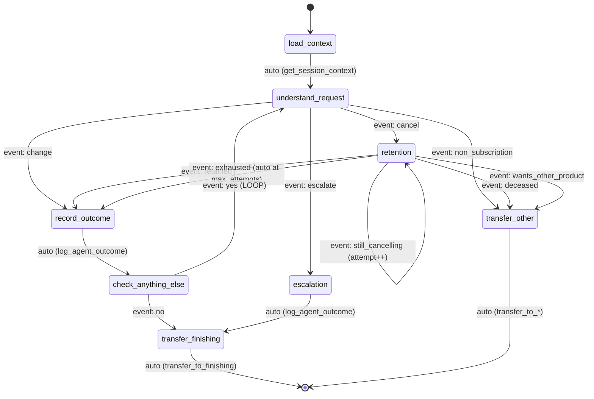

### Mermaid Diagram — FSM (Reception Agent)

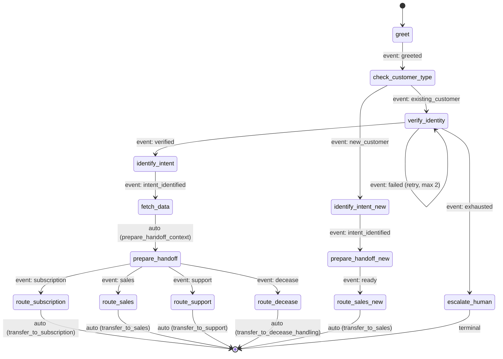

### Mermaid Diagram — FSM (Sales Agent)

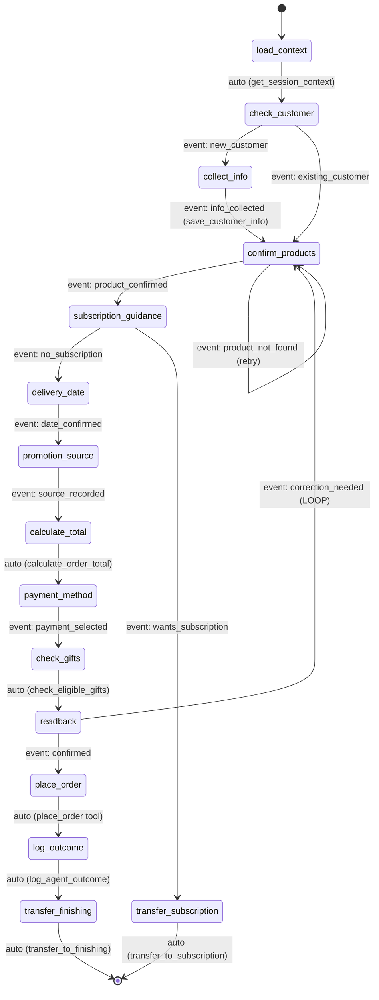

### Mermaid Diagram — FSM (Decease Handling Agent)

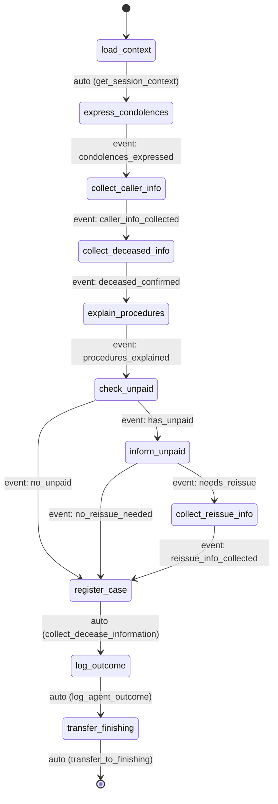

### Mermaid Diagram — FSM (Finishing Agent)

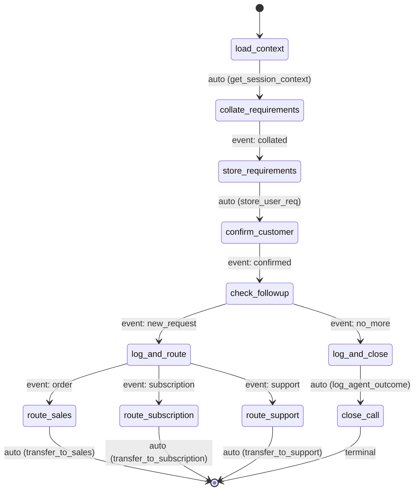

### Mermaid Diagram — FSM (Full Multi-Agent Orchestration)

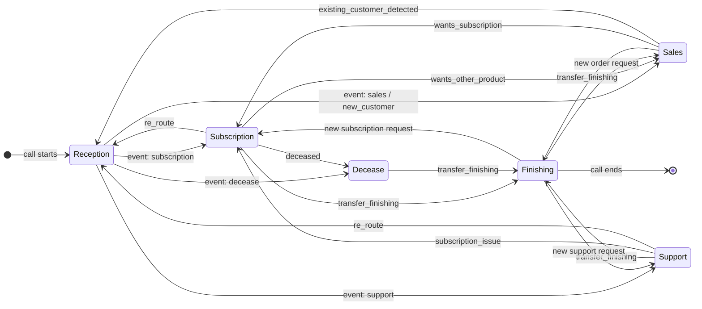

### Core Functions

```python
def transition(session, agent_name: str, event: str) -> str | None:
    """Move to the next state based on current state + event.
    Returns new state name, or None if terminal/invalid.
    """
    sm = session.userdata["state_machine"][agent_name]
    current = sm["current_state"]
    state_def = sm["states"][current]

    if state_def.get("terminal"):
        return None

    # Handle bounded retries
    if "max_attempts" in state_def:
        state_def["attempt"] = state_def.get("attempt", 0) + 1
        if state_def["attempt"] >= state_def["max_attempts"]:
            event = "exhausted"

    # Resolve next state
    next_state = None
    if event and "transitions" in state_def:
        next_state = state_def["transitions"].get(event)
    if not next_state:
        next_state = state_def.get("on_complete")

    if next_state:
        sm["history"].append({"from": current, "to": next_state, "event": event})
        sm["current_state"] = next_state

    return next_state


def auto_transition_on_tool(session, agent_name: str, tool_name: str) -> str | None:
    """Called after any tool execution. If the current state has
    auto_tool matching this tool, fire on_complete automatically.
    """
    sm = session.userdata["state_machine"][agent_name]
    current = sm["current_state"]
    state_def = sm["states"][current]

    if state_def.get("auto_tool") == tool_name:
        return transition(session, agent_name, event="__auto__")
    return None
```

### LLM Prompt Injection (What the Model Sees)

Instead of a full checklist, the LLM sees only its current state and available actions:

```
[STATE: retention | attempt 2 of 3]
You are in the retention conversation. The customer wants to cancel.

Available actions (call emit_event with one of these):
  → "retained"            — customer agreed to stay     → next: record_outcome
  → "still_cancelling"    — customer declined, try again → next: retention (attempt 3)
  → "deceased"            — customer is deceased         → next: transfer_other
  → "wants_other_product" — customer wants a different product → next: transfer_other

If you reach attempt 3 and the customer still declines, "exhausted" fires automatically.
```

This is much cleaner than a 15-line checklist. The model knows exactly what it can do and what happens next.

### Pros & Cons

| Pros | Cons |
|---|---|
| Explicit transitions — no ambiguity about what comes next | More upfront design work per agent |
| Loops, retries, and branching are first-class | State graph can get complex for agents with many paths |
| LLM prompt is simpler and more actionable | Need to map every tool to its `auto_tool` state |
| Audit trail via `history` array | Migration from current system requires rewriting `build_initial_state_machine()` |
| `max_attempts` removes LLM counting responsibility | — |
| Race-condition safe (single `current_state` pointer) | — |

---

## 4. Option 3 — Event-Driven Orchestrator

### How It Works

The state machine is pulled out of `session.userdata` entirely and becomes a standalone orchestration layer that sits between LiveKit's `AgentSession` and your agents. Think of it as a lightweight workflow engine.

Key differences from Option 2:
- **Centralized orchestrator**: A single `WorkflowOrchestrator` class manages all agent state graphs. It's not a dict in userdata — it's a proper object with methods.
- **Event bus**: Tool calls, LLM responses, and agent handoffs all emit events to the orchestrator. The orchestrator decides transitions and can trigger agent swaps automatically.
- **Agent-agnostic routing**: The orchestrator knows the full multi-agent graph. When the subscription agent reaches `transfer_finishing`, the orchestrator doesn't need the LLM to call `transfer_to_finishing` — it does it directly.
- **Middleware hooks**: Pre/post transition hooks for logging, validation, metrics, etc.
- **Persistence**: State can be serialized to a database for crash recovery and analytics.

### Architecture

```
┌─────────────────────────────────────────────────────┐
│                  LiveKit AgentSession                │
│                                                     │
│  ┌──────────┐   events    ┌──────────────────────┐  │
│  │  Agent    │ ─────────► │  WorkflowOrchestrator │  │
│  │ (LLM +   │            │                      │  │
│  │  Tools)   │ ◄───────── │  - state graphs      │  │
│  │          │  commands   │  - transition engine  │  │
│  └──────────┘            │  - event bus          │  │
│                          │  - audit log          │  │
│                          │  - agent router       │  │
│                          └──────────────────────┘  │
│                                   │                 │
│                                   ▼                 │
│                          ┌──────────────────┐       │
│                          │  Persistence     │       │
│                          │  (Redis / DB)    │       │
│                          └──────────────────┘       │
└─────────────────────────────────────────────────────┘
```

### Data Structure

```python
class WorkflowOrchestrator:
    def __init__(self, session: AgentSession):
        self.session = session
        self.graphs: dict[str, StateGraph] = {}
        self.event_log: list[Event] = []
        self.middleware: list[Callable] = []

    def register_agent(self, name: str, graph: StateGraph):
        """Register an agent's state graph."""
        self.graphs[name] = graph

    def emit(self, agent_name: str, event: str, payload: dict = None):
        """Process an event — transition state, trigger hooks, maybe swap agents."""
        graph = self.graphs[agent_name]
        old_state = graph.current
        new_state = graph.transition(event)

        # Run middleware (logging, metrics, validation)
        for mw in self.middleware:
            mw(agent_name, old_state, new_state, event, payload)

        # Log for audit
        self.event_log.append(Event(agent_name, old_state, new_state, event, payload))

        # Auto-swap agent if terminal state has a handoff target
        if graph.states[new_state].handoff_to:
            target = graph.states[new_state].handoff_to
            self._swap_agent(target)

    def _swap_agent(self, target_agent: str):
        """Programmatically swap the active agent — no LLM decision needed."""
        # Create the target agent and call session.update_agent()
        ...


@dataclass
class StateGraph:
    current: str
    states: dict[str, State]
    history: list[tuple[str, str, str]]  # (from, to, event)

    def transition(self, event: str) -> str:
        state = self.states[self.current]
        next_state = state.resolve(event)
        self.history.append((self.current, next_state, event))
        self.current = next_state
        return next_state


@dataclass
class State:
    name: str
    transitions: dict[str, str]
    auto_tool: str | None = None
    max_attempts: int | None = None
    attempt: int = 0
    terminal: bool = False
    handoff_to: str | None = None  # auto-swap to this agent on entry

    def resolve(self, event: str) -> str:
        if self.max_attempts and self.attempt >= self.max_attempts:
            event = "exhausted"
        return self.transitions.get(event, self.transitions.get("__default__"))
```

### Mermaid Diagram — Event-Driven Orchestrator Architecture

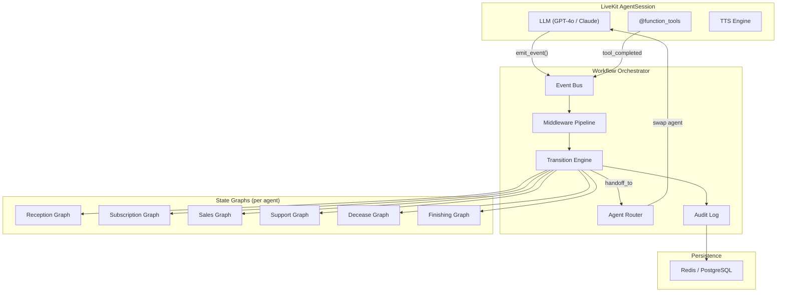

### Mermaid Diagram — Event Flow (Subscription Cancellation Example)

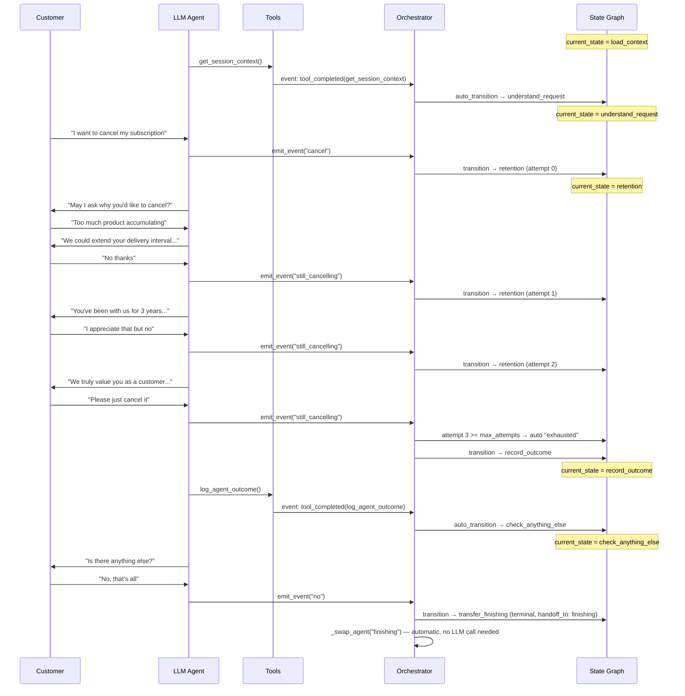

### Pros & Cons

| Pros | Cons |
|---|---|
| Cleanest separation of concerns — LLM only does conversation, orchestrator handles flow | Largest refactor — requires new classes, event bus, middleware |
| Agent swaps are automatic — no reliance on LLM calling transfer functions | More moving parts to debug |
| Full audit trail with persistence | Needs Redis/DB for crash recovery |
| Middleware enables metrics, rate limiting, A/B testing | Over-engineered if you only have 6 agents |
| State graphs are testable independently of LLM | LiveKit's built-in handoff mechanism is partially bypassed |
| Crash recovery — orchestrator can resume from last persisted state | — |

---

## 5. Comparison Matrix

| Feature | Current (Flat List) | Option 1 (Task Trees) | Option 2 (FSM) | Option 3 (Orchestrator) |
|---|---|---|---|---|
| **Branching** | ❌ None | ⚠️ Via conditions | ✅ Event-based | ✅ Event-based |
| **Loops / Repeats** | ❌ Full reset only | ✅ Subtree reset | ✅ Transition cycles | ✅ Transition cycles |
| **Nesting** | ❌ None | ✅ Children array | ⚠️ Via sub-graphs | ✅ Composable graphs |
| **Bounded Retries** | ❌ LLM counts | ⚠️ Manual | ✅ `max_attempts` | ✅ `max_attempts` |
| **Auto-advance on tool** | ⚠️ Hardcoded | ✅ `auto_tool` | ✅ `auto_tool` | ✅ Event bus |
| **LLM prompt clarity** | ⚠️ Long checklist | ⚠️ Indented checklist | ✅ Current state + actions | ✅ Current state + actions |
| **Audit trail** | ❌ Logs only | ❌ Logs only | ✅ `history` array | ✅ Persistent event log |
| **Agent routing** | ⚠️ LLM decides | ⚠️ LLM decides | ⚠️ LLM decides | ✅ Automatic |
| **Crash recovery** | ❌ None | ❌ None | ⚠️ Userdata dump | ✅ DB persistence |
| **Refactor effort** | — | 🟢 Low | 🟡 Medium | 🔴 High |
| **Complexity** | 🟢 Simple | 🟡 Moderate | 🟡 Moderate | 🔴 High |
| **Production readiness** | ⚠️ MVP | 🟡 Good | ✅ Production | ✅ Enterprise |

### Recommendation

**Option 2 (FSM with Transitions)** is the sweet spot for your system. It gives you everything you need — branching, loops, retries, auto-advance, clean LLM prompts — without the overhead of a full orchestration layer. Your 6-agent system doesn't need Redis persistence or an event bus yet. If you scale to 15+ agents or need crash recovery, Option 3 becomes worth it.

The migration path is also clean: replace `build_initial_state_machine()` with FSM definitions, replace `advance_task()` with `transition()`, update `format_state_machine()` to show current state + transitions, and update `complete_task` to become `emit_event`. The agent code (prompts, tools, handoffs) stays mostly the same.
