# Transformer — Complete Notes

> *"Attention Is All You Need"* — Vaswani et al., 2017

---

## 1. What Problem Does It Solve?

Before Transformers, we used RNNs and LSTMs for language tasks. They had two big problems:

- **Slow** — they read words one by one, no parallelism
- **Forgetful** — by the time they reach word 100, they've mostly forgotten word 1

Transformers fix both: every word can look at every other word **at the same time**.

---

## 2. The Big Picture

A Transformer has two halves: an **Encoder** (reads input) and a **Decoder** (writes output).

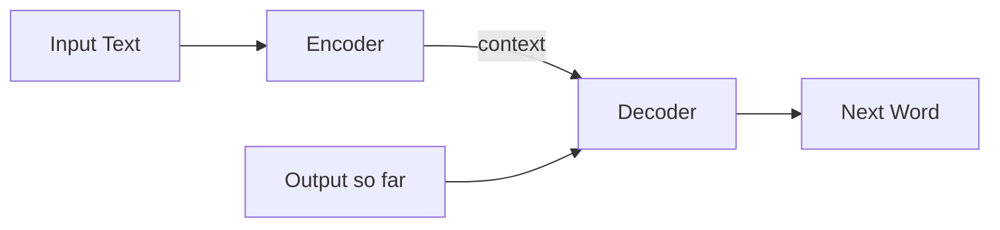

Think of it like this:
- **Encoder** = a reader that deeply understands the input
- **Decoder** = a writer that generates the output word by word, while looking back at what the reader understood

---

## 3. Step-by-Step: How Input Gets Prepared

### 3.1 Tokenization

Text is split into small pieces (tokens). Not always full words:

```
"unhappiness" → ["un", "happi", "ness"]
```

Common methods: BPE (GPT), WordPiece (BERT), SentencePiece (T5).

### 3.2 Embedding

Each token is converted to a vector (list of numbers) of size `d_model = 512`.

```
"cat" → [0.2, -0.5, 0.8, ..., 0.1]   (512 numbers)
```

### 3.3 Positional Encoding

Since all tokens are processed in parallel, the model has no idea about word order. We add a position signal:

```
Final Input = Token Embedding + Positional Encoding
```

The original paper uses sine/cosine waves at different frequencies:

```
PE(pos, 2i)   = sin(pos / 10000^(2i/d_model))
PE(pos, 2i+1) = cos(pos / 10000^(2i/d_model))
```

Where:
- `pos` = position of the token in the sequence (0, 1, 2, ...)
- `i` = dimension index (0 to d_model/2)
- `d_model` = model dimension (512)

Each position gets a unique pattern. The model learns to interpret these patterns as "this token is at position X."

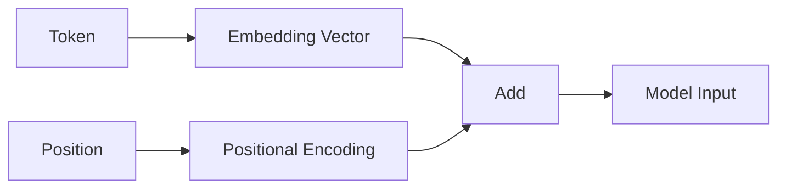

---

## 4. Attention — The Core Idea

Attention answers one question: **"When processing this word, how much should I focus on each other word?"**

### 4.1 Query, Key, Value — An Analogy

Imagine a library:
- **Query (Q)** = your question: "I need info about animals"
- **Key (K)** = the label on each book: "Biology", "History", "Cooking"
- **Value (V)** = the actual content of each book

The process:
1. Compare your **query** against every **key** (dot product)
2. The better the match, the higher the **attention weight**
3. Use those weights to blend the **values** together

### 4.2 The Math

```
Attention(Q, K, V) = softmax(Q · Kᵀ / √d_k) · V
```

Where:
- `Q` = Query matrix (what each token is looking for)
- `K` = Key matrix (what each token advertises about itself)
- `V` = Value matrix (the actual information each token provides)
- `Kᵀ` = K transposed (flipped rows/columns for dot product)
- `d_k` = dimension of each key vector (64 in the original paper)
- `√d_k` = square root of d_k, used to scale down large dot products
- `softmax` = converts raw scores into probabilities that sum to 1

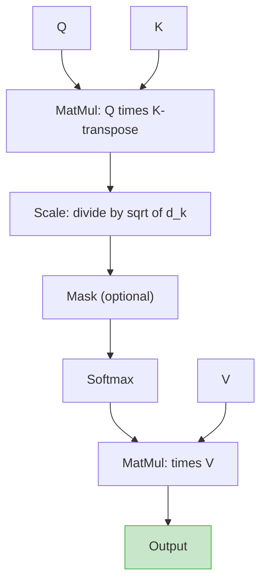

**Why divide by √d_k?** Without it, dot products get very large when vectors are long. Large values push softmax to extremes (almost 0 or almost 1), which kills gradients. Scaling keeps things stable.

### 4.3 Where Do Q, K, V Come From?

They're all created from the same input, just with different learned weight matrices:

```
Q = Input × W_Q
K = Input × W_K
V = Input × W_V
```

Where:
- `Input` = token representations (shape: sequence_length × d_model)
- `W_Q, W_K, W_V` = learned weight matrices (shape: d_model × d_k)
- These projections let the model learn what to ask (Q), what to advertise (K), and what to provide (V)

---

## 5. Multi-Head Attention

One attention head can only focus on one type of relationship. Multi-head attention runs **h parallel attention heads**, each learning different patterns.

```
MultiHead(Q, K, V) = Concat(head_1, ..., head_h) × W_O
```

Where:
- `head_i` = output of the i-th attention head (each is d_k = 64 dimensions)
- `h` = number of heads (8 in the original paper)
- `Concat(...)` = concatenation of all head outputs (8 × 64 = 512)
- `W_O` = learned output projection matrix (shape: d_model × d_model)

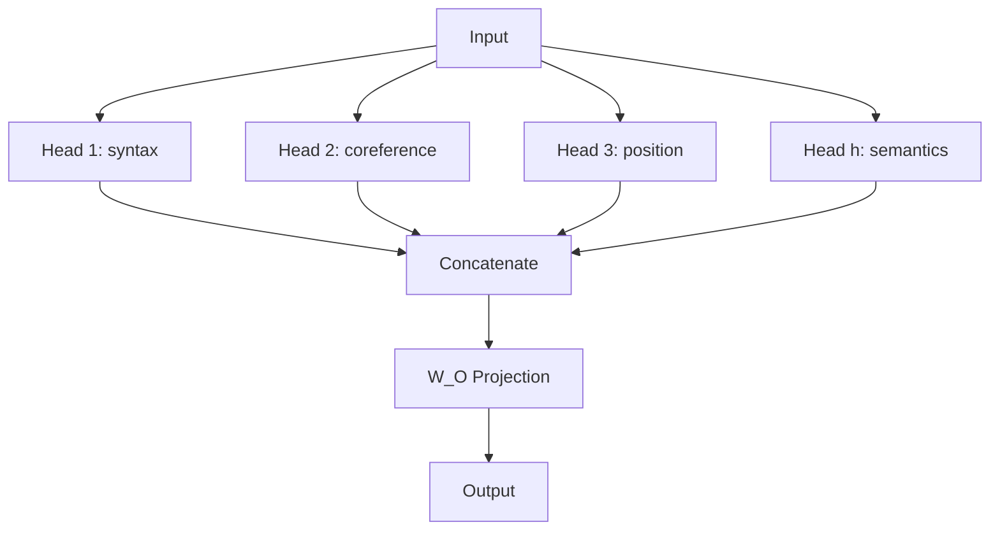

Original paper: **8 heads**, each working in 64 dimensions (8 × 64 = 512 = d_model).

---

## 6. Three Types of Attention

| Type | Used In | What It Does |
|---|---|---|
| **Self-Attention** | Encoder | Each word looks at all other input words |
| **Masked Self-Attention** | Decoder | Each word looks only at previous output words (can't peek ahead) |
| **Cross-Attention** | Decoder | Output words look at the full input (connects decoder to encoder) |

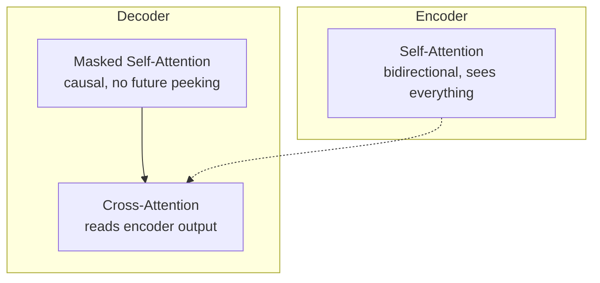

### Why mask in the decoder?

During training, the decoder sees the entire target sentence at once (for speed). The mask prevents it from cheating by looking at future words. Position 3 can only attend to positions 1, 2, 3.

---

## 7. Feed-Forward Network (FFN)

After attention, each token passes through a small 2-layer neural network **independently**:

```
FFN(x) = ReLU(x · W₁ + b₁) · W₂ + b₂
```

Where:
- `x` = input vector for a single token (size d_model = 512)
- `W₁` = first weight matrix (shape: d_model × d_ff = 512 × 2048)
- `b₁` = first bias vector (size d_ff = 2048)
- `ReLU` = activation function: max(0, value) — zeroes out negatives
- `W₂` = second weight matrix (shape: d_ff × d_model = 2048 × 512)
- `b₂` = second bias vector (size d_model = 512)

- First layer expands: 512 → 2048
- ReLU activation (zero out negatives)
- Second layer compresses: 2048 → 512

This is where the model stores **factual knowledge**. Attention figures out relationships between words; FFN processes each word's representation individually.

---

## 8. Residual Connections + Layer Norm

Every sub-layer (attention or FFN) is wrapped with two helpers:

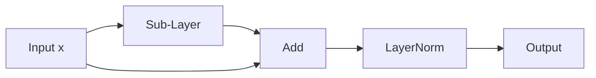

- **Residual connection** (`x + SubLayer(x)`) — lets gradients flow directly through the network, preventing vanishing gradients in deep stacks
- **Layer normalization** — stabilizes training by normalizing values across the feature dimension

---

## 9. The Encoder

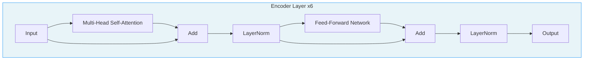

- 6 identical layers stacked
- Each layer: Self-Attention → Add&Norm → FFN → Add&Norm
- Fully **bidirectional** — every token sees every other token
- Output: one contextualized vector per input token

---

## 10. The Decoder

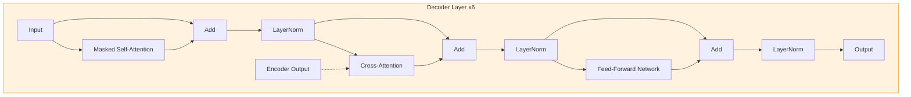

- 6 identical layers stacked
- Each layer: Masked Self-Attention → Add&Norm → Cross-Attention → Add&Norm → FFN → Add&Norm
- Masked self-attention: autoregressive (no future peeking)
- Cross-attention: reads the encoder's output

---

## 11. Output Head

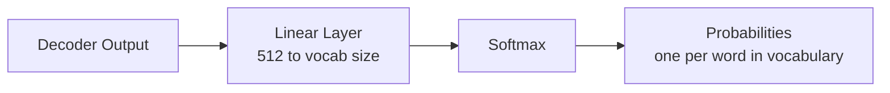

The linear layer projects from `d_model` (512) to vocabulary size (e.g., 37,000). Softmax turns that into probabilities. The highest-probability token is the prediction.

**Weight tying**: the output linear layer often shares weights with the input embedding matrix. This saves parameters and improves performance.

---

## 12. Training

### 12.1 Teacher Forcing

During training, the decoder receives the **correct** previous tokens as input (not its own predictions). This makes training stable and fast.

```
Input to decoder:  [START] I  love cats
Target output:      I     love cats [END]
```

### 12.2 Loss Function

**Cross-entropy loss** with **label smoothing** (ε = 0.1). Instead of targeting 100% confidence on the correct word, it targets 90% correct + 10% spread across all other words. This prevents overconfidence.

### 12.3 Optimizer

**Adam** with custom learning rate schedule:

```
lr = d_model^(-0.5) × min(step^(-0.5), step × warmup_steps^(-1.5))
```

Where:
- `lr` = learning rate at the current training step
- `d_model` = model dimension (512) — larger models get smaller learning rates
- `step` = current training step number (1, 2, 3, ...)
- `warmup_steps` = number of steps to linearly increase lr (4000 in the paper)

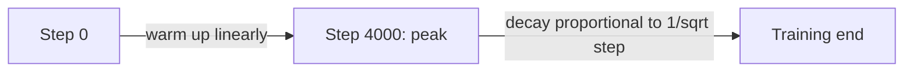

Warmup prevents early instability. Decay prevents late overfitting.

### 12.4 Regularization

- **Dropout** (p = 0.1) on attention weights, sub-layer outputs, and embeddings
- **Label smoothing** (ε = 0.1)

### 12.5 Fine-Tuning — What Parameters Change?

Fine-tuning = taking a pre-trained model and training it further on a smaller, task-specific dataset.

#### Full Fine-Tuning

**All parameters** are updated — every weight matrix in the model:

| Layer | Parameters Updated | What They Control |
|---|---|---|
| Embedding layer | Token embedding matrix | How words are represented |
| W_Q, W_K, W_V (all layers) | Attention projection matrices | What the model attends to |
| W_O (all layers) | Output projection | How attention heads combine |
| W₁, b₁, W₂, b₂ (all layers) | FFN weights and biases | Factual knowledge, patterns |
| LayerNorm γ, β (all layers) | Scale and shift parameters | Normalization behavior |
| Output head (linear layer) | Final projection to vocab | Word prediction preferences |

Total: **all ~65M parameters** (for base) get gradient updates.

**Problem**: expensive, needs lots of GPU memory, risk of catastrophic forgetting (model forgets pre-trained knowledge).

#### Parameter-Efficient Fine-Tuning (PEFT)

Only a **small subset** of parameters are updated. The rest stay frozen.

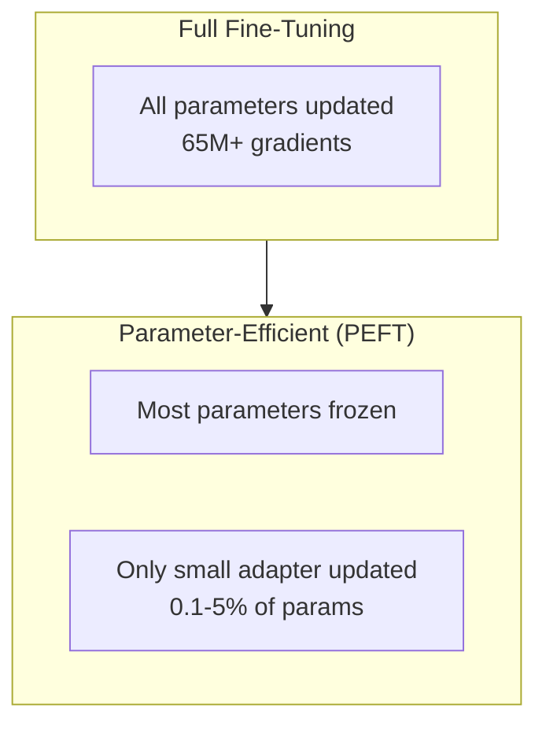

| Method | What Changes | Params Updated | How It Works |
|---|---|---|---|
| **LoRA** | Low-rank matrices added to W_Q, W_V | ~0.1-1% | Adds small A×B matrices beside frozen weights. Output = W×x + A×B×x |
| **QLoRA** | Same as LoRA but model is 4-bit quantized | ~0.1-1% | LoRA on a compressed model — fits on smaller GPUs |
| **Adapter layers** | Small FFN modules inserted between layers | ~1-5% | Tiny bottleneck networks (down-project → ReLU → up-project) |
| **Prefix tuning** | Learnable vectors prepended to K, V | ~0.1% | Adds "virtual tokens" that steer attention |
| **Prompt tuning** | Learnable embeddings prepended to input | ~0.01% | Soft prompt vectors optimized by gradient descent |
| **BitFit** | Only bias terms (b₁, b₂, etc.) | ~0.1% | Surprisingly effective for small tasks |

#### LoRA — The Most Popular Method

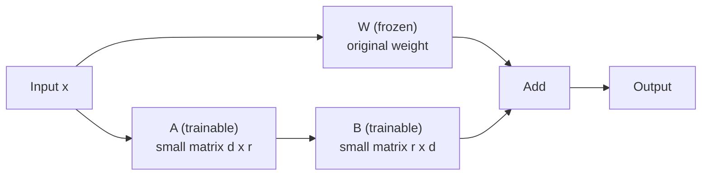

**How LoRA works**:
- Original: output = W × x (W is frozen, not updated)
- LoRA adds: output = W × x + (A × B) × x
- A is shape (d_model × r), B is shape (r × d_model)
- r = rank, typically 4-64 (much smaller than d_model = 512 or 4096)
- Only A and B are trained — W stays frozen

**Why it works**: Weight changes during fine-tuning tend to be low-rank (they don't need the full expressiveness of the original matrix). LoRA exploits this.

**Example parameter count**:
- Full W_Q matrix: 4096 × 4096 = 16.7M parameters
- LoRA with r=16: (4096 × 16) + (16 × 4096) = 131K parameters (0.8% of original)

#### When to Use What

| Scenario | Recommended Approach |
|---|---|
| Lots of data + compute available | Full fine-tuning |
| Limited GPU memory | QLoRA |
| Multiple tasks on one base model | LoRA (swap adapters per task) |
| Very small dataset (<1000 examples) | Prompt tuning or few-shot prompting |
| Don't want to change model at all | In-context learning (just prompting) |

---

## 13. Inference — Generating Text

At inference time, there's no teacher forcing. The model generates **one token at a time**, feeding each prediction back as input:

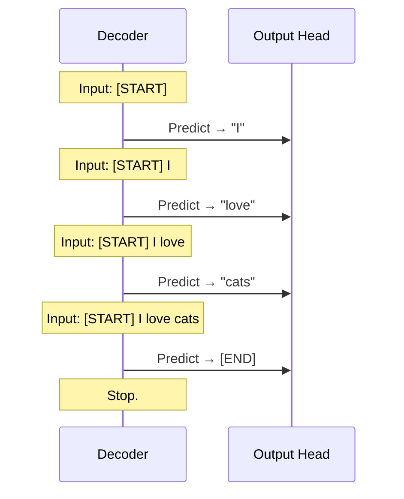

### Decoding Strategies

| Strategy | How It Works | Tradeoff |
|---|---|---|
| **Greedy** | Always pick the highest-probability token | Fast but can miss better sequences |
| **Beam Search** | Track top-k candidates at each step | Better quality, slower |
| **Top-k Sampling** | Sample from the top k tokens | More creative, less deterministic |
| **Top-p (Nucleus)** | Sample from tokens covering p% of probability mass | Adaptive creativity |
| **Temperature** | Scale logits before softmax. Low = confident, High = random | Controls randomness |

---

## 14. Worked Example — "It was raining yesterday"

Let's trace how self-attention works on the sentence **"It was raining yesterday"** using d_k = 4 (tiny dimensions for illustration). We'll do the full math.

### Step 0 — Setup

We have 4 tokens. After embedding + positional encoding, each token is a vector of size d_k = 4:

```
Token 0 "It":        [1.0, 0.5, 0.0, 0.2]
Token 1 "was":       [0.3, 1.0, 0.5, 0.0]
Token 2 "raining":   [0.0, 0.7, 1.0, 0.8]
Token 3 "yesterday": [0.5, 0.0, 0.3, 1.0]
```

For simplicity, we use Q = K = V = Input (identity weight matrices). In a real model, W_Q, W_K, W_V would transform these differently.

### Step 1 — Compute Q × Kᵀ (dot products)

Each cell = dot product between row token's Q and column token's K.

**Formula**: dot(a, b) = a₀×b₀ + a₁×b₁ + a₂×b₂ + a₃×b₃

Example: dot("It", "was") = (1.0×0.3) + (0.5×1.0) + (0.0×0.5) + (0.2×0.0) = 0.3 + 0.5 + 0.0 + 0.0 = **0.80**

Full matrix:

```
Q × Kᵀ =
                It      was     raining  yesterday
It        [   1.29    0.80     0.35      0.70   ]
was       [   0.80    1.25     0.70      0.15   ]
raining   [   0.35    0.70     1.49      0.80   ]
yesterday [   0.50    0.15     0.80      1.29   ]
```

**What this means**: Higher number = more similarity between two tokens. "It" is most similar to itself (1.29). "raining" and "yesterday" have a decent connection (0.80) — makes sense, they're related.

### Step 2 — Scale by √d_k

**Why**: d_k = 4, so √d_k = 2. We divide every value by 2 to prevent large numbers from making softmax too extreme.

```
Scaled =
                It      was     raining  yesterday
It        [   0.645   0.400   0.175    0.350   ]
was       [   0.400   0.625   0.350    0.075   ]
raining   [   0.175   0.350   0.745    0.400   ]
yesterday [   0.250   0.075   0.400    0.645   ]
```

### Step 3 — Apply Softmax (row by row)

**Formula**: softmax(x_i) = e^(x_i) / sum(e^(x_j) for all j in row)

Example for "It" row:
- e^0.645 = 1.906
- e^0.400 = 1.492
- e^0.175 = 1.191
- e^0.350 = 1.419
- Sum = 1.906 + 1.492 + 1.191 + 1.419 = 6.008
- Softmax: [1.906/6.008, 1.492/6.008, 1.191/6.008, 1.419/6.008]

```
Attention Weights (each row sums to 1.0) =
                It      was     raining  yesterday
It        [   0.317   0.248   0.198    0.236   ]
was       [   0.272   0.340   0.259    0.129   ]
raining   [   0.199   0.237   0.352    0.212   ]
yesterday [   0.222   0.186   0.258    0.334   ]
```

**Reading the matrix**:
- Row = "who is looking" (the query token)
- Column = "who is being looked at" (the key token)
- Value = how much attention the row token pays to the column token

**Interpretation**:
- "It" pays most attention to itself (0.317) — it's a pronoun, self-referential
- "was" pays most attention to itself (0.340) and "It" (0.272) — verb looks at its subject
- "raining" pays most attention to itself (0.352) and "was" (0.237) — verb form looks at auxiliary
- "yesterday" pays most attention to itself (0.334) and "raining" (0.258) — time word connects to the action

### Step 4 — Multiply Attention Weights × V

Each output token = weighted blend of all value vectors.

**Formula for "It" output**:

```
Output("It") = 0.317 × V("It") + 0.248 × V("was") + 0.198 × V("raining") + 0.236 × V("yesterday")

= 0.317 × [1.0, 0.5, 0.0, 0.2]
+ 0.248 × [0.3, 1.0, 0.5, 0.0]
+ 0.198 × [0.0, 0.7, 1.0, 0.8]
+ 0.236 × [0.5, 0.0, 0.3, 1.0]

= [0.317, 0.159, 0.000, 0.063]
+ [0.074, 0.248, 0.124, 0.000]
+ [0.000, 0.139, 0.198, 0.158]
+ [0.118, 0.000, 0.071, 0.236]

= [0.509, 0.546, 0.393, 0.457]
```

**What happened**: "It" started as [1.0, 0.5, 0.0, 0.2] but after attention it became [0.509, 0.546, 0.393, 0.457]. It now contains information blended from all other tokens — it's been **contextualized**.

### Step 5 — Full Output Matrix

```
Output =
                dim0    dim1    dim2    dim3
It        [   0.509   0.546   0.393   0.457  ]
was       [   0.491   0.583   0.345   0.363  ]
raining   [   0.426   0.563   0.467   0.509  ]
yesterday [   0.449   0.487   0.430   0.545  ]
```

Every token is now a blend of all tokens, weighted by relevance. This is the output of **one attention head**.

### What Happens Next

- With **8 heads**, this process runs 8 times in parallel (each with different W_Q, W_K, W_V), capturing different relationships
- Results are concatenated and projected through W_O
- Then passed through FFN, residual connections, and LayerNorm
- This repeats for all 6 layers, building increasingly abstract representations

### Visual Summary

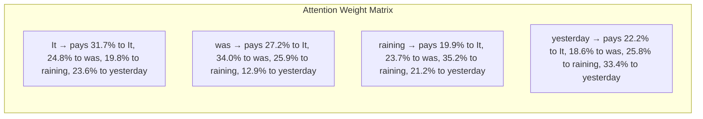

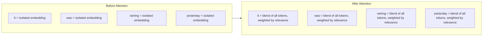

---

## 15. What Attention Heads Learn

Research shows different heads specialize in different linguistic patterns:

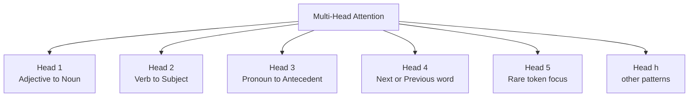

Some heads track syntax, some track coreference, some track positional proximity. The model figures this out on its own during training.

---

## 16. Parameter Count

For the original Transformer-base (65M parameters):

| Component | Formula | Count |
|---|---|---|
| Token embeddings | vocab × d_model | 37K × 512 ≈ 19M |
| Positional encoding | — | 0 (computed, not learned) |
| Per encoder layer | 4 × d_model² + 2 × d_model × d_ff | ≈ 3.1M |
| × 6 encoder layers | | ≈ 18.9M |
| Per decoder layer | 6 × d_model² + 2 × d_model × d_ff | ≈ 4.2M |
| × 6 decoder layers | | ≈ 25.2M |
| Output linear | d_model × vocab (tied with embeddings) | 0 (shared) |
| **Total** | | **≈ 63M** |

Most parameters live in the FFN layers (the W₁ and W₂ matrices).

---

## 17. Transformer Variants — Deep Dive

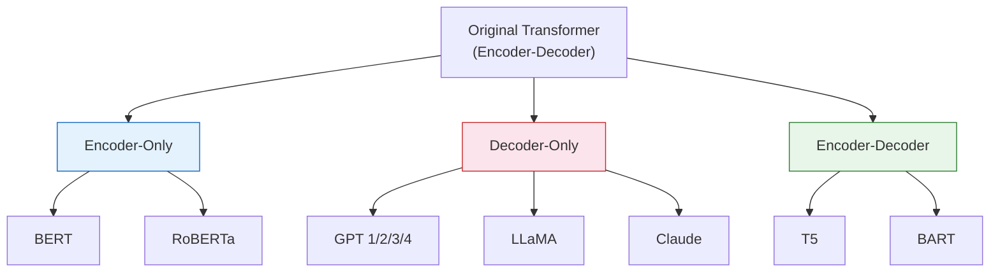

| Family | What It Keeps | Training Objective | Good For |
|---|---|---|---|
| **Encoder-only** | Encoder only | Masked Language Model (predict hidden words) | Classification, search, NER |
| **Decoder-only** | Decoder only | Next-token prediction | Text generation, chat, code |
| **Encoder-Decoder** | Both | Denoising / span corruption | Translation, summarization |

### 17.1 Encoder-Only Models (BERT, RoBERTa, ELECTRA)

**What it is**: Only the encoder stack. No decoder. No text generation. Built for **understanding** text.

#### Architecture

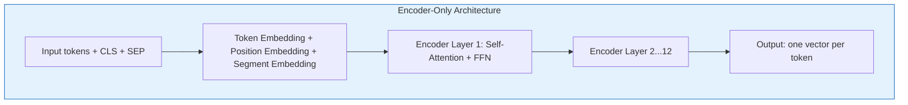

Each layer has:
- Multi-Head Self-Attention (**bidirectional** — every token sees every other token)
- Add + LayerNorm
- Feed-Forward Network
- Add + LayerNorm

No decoder, no cross-attention, no causal mask.

#### Inside One Encoder-Only Layer (Detailed)

```mermaid
graph TB
    subgraph Layer["Single BERT Encoder Layer"]
        IN["Input (768-dim per token)"] --> WQ["W_Q: 768x64 per head"]
        IN --> WK["W_K: 768x64 per head"]
        IN --> WV["W_V: 768x64 per head"]
        WQ --> Q["Q (12 heads x 64-dim)"]
        WK --> K["K (12 heads x 64-dim)"]
        WV --> V["V (12 heads x 64-dim)"]
        Q --> ATT["Scaled Dot-Product Attention\nper head (bidirectional)"]
        K --> ATT
        V --> ATT
        ATT --> CONCAT["Concat all 12 heads (768-dim)"]
        CONCAT --> WO["W_O: 768x768"]
        WO --> DROP1["Dropout (0.1)"]
        DROP1 --> ADD1["Add (residual)"]
        IN --> ADD1
        ADD1 --> LN1["LayerNorm"]
        LN1 --> FF1["Linear: 768 to 3072 (expand 4x)"]
        FF1 --> GELU["GELU activation"]
        GELU --> FF2["Linear: 3072 to 768 (compress)"]
        FF2 --> DROP2["Dropout (0.1)"]
        DROP2 --> ADD2["Add (residual)"]
        LN1 --> ADD2
        ADD2 --> LN2["LayerNorm"]
        LN2 --> OUT["Output (768-dim per token)"]
    end
```

**Data shapes at each step** (for BERT-base, batch=1, seq_len=10):

```
Input:              [10 tokens × 768 dims]
After W_Q per head: [10 × 64] (×12 heads)
Attention scores:   [10 × 10] per head (who attends to whom)
After attention:    [10 × 64] per head
After concat:       [10 × 768]
After W_O:          [10 × 768]
After FFN expand:   [10 × 3072]
After FFN compress: [10 × 768]
Output:             [10 × 768]
```

**Parameter count per layer**:
- W_Q, W_K, W_V, W_O: 4 × (768 × 768) = 2.36M
- FFN W₁, W₂: (768 × 3072) + (3072 × 768) = 4.72M
- LayerNorm (2×): 4 × 768 = 3K (negligible)
- **Total per layer: ~7.1M**
- **12 layers: ~85M** (+ embeddings = 110M total)

#### How Attention Works — Bidirectional

```
Sentence: "The bank by the river was steep"

When processing "bank":
  ← looks left:  "The"
  → looks right: "by", "the", "river", "was", "steep"
  
  Sees "river" → understands "bank" means riverbank, not financial bank
```

**Attention mask** — fully open:

```
         The  bank  by   the  river was  steep
The    [  1    1    1    1    1     1    1   ]
bank   [  1    1    1    1    1     1    1   ]
by     [  1    1    1    1    1     1    1   ]
...every token sees everything
```

#### Pre-Training — Masked Language Modeling (MLM)

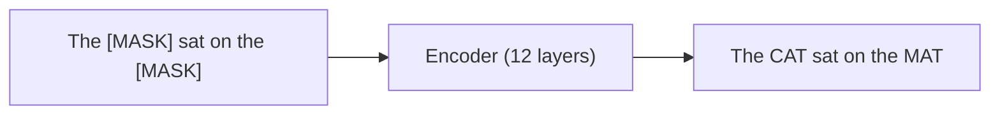

1. Take a sentence: "The cat sat on the mat"
2. Randomly mask 15% of tokens: "The [MASK] sat on the [MASK]"
3. Feed into encoder — every token sees every other token
4. Model predicts the original tokens at masked positions
5. Loss = cross-entropy between predicted and actual tokens

**BERT also uses Next Sentence Prediction (NSP)**: given two sentences, predict if B follows A. RoBERTa later showed NSP isn't necessary.

#### Special Tokens

| Token | Purpose |
|---|---|
| `[CLS]` | Added at start. Its output vector represents the whole sentence. Used for classification. |
| `[SEP]` | Separates two sentences (for question answering, sentence pairs) |
| `[MASK]` | Replaces tokens during pre-training |
| `[PAD]` | Pads shorter sentences to match batch length |

#### Fine-Tuning

Add a small task-specific head on top of the pre-trained encoder:

```mermaid
graph TB
    subgraph Classification["Sentiment Classification"]
        IN1["[CLS] I love this movie [SEP]"] --> ENC1["Pre-trained Encoder"]
        ENC1 --> CLS1["[CLS] output vector (768-dim)"]
        CLS1 --> HEAD1["Linear layer (768 to 2)"]
        HEAD1 --> OUT1["positive / negative"]
    end

    subgraph NER["Named Entity Recognition"]
        IN2["[CLS] John lives in Paris [SEP]"] --> ENC2["Pre-trained Encoder"]
        ENC2 --> TOK2["Every token output vector"]
        TOK2 --> HEAD2["Linear layer per token"]
        HEAD2 --> OUT2["PERSON O O O LOCATION O"]
    end
```

**What gets updated**: All encoder weights (small updates, lr = 2e-5 to 5e-5) + new classification head (trained from scratch).

#### Model Sizes

| Model | Layers | d_model | Heads | Parameters |
|---|---|---|---|---|
| BERT-base | 12 | 768 | 12 | 110M |
| BERT-large | 24 | 1024 | 16 | 340M |

#### Strengths and Limitations

| Strengths | Limitations |
|---|---|
| Best at understanding tasks (classification, NER, search) | Cannot generate text |
| Bidirectional context = richer representations | Fixed input length (512 tokens) |
| Fast fine-tuning on small datasets | Not suitable for open-ended tasks |
| Great sentence embeddings for search/similarity | Smaller scale than modern LLMs |

---

### 17.2 Decoder-Only Models (GPT, LLaMA, Claude, Gemini)

**What it is**: Only the decoder stack. No encoder, no cross-attention. Built for **generating** text. This is the architecture behind ChatGPT, Claude, LLaMA, and most modern LLMs.

#### Architecture

```mermaid
graph TB
    subgraph Decoder_Only["Decoder-Only Architecture"]
        TOK["Input tokens"] --> EMB["Token Embedding + Position Embedding"]
        EMB --> L1["Decoder Layer 1: Masked Self-Attention + FFN"]
        L1 --> L2["Decoder Layer 2...N"]
        L2 --> HEAD["Linear + Softmax"]
        HEAD --> OUT["Next token probability"]
    end
    style Decoder_Only fill:#fce4ec,stroke:#c62828
```

Each layer has:
- **Masked** Multi-Head Self-Attention (causal — can only see current + previous tokens)
- Add + LayerNorm (or RMSNorm in modern models)
- Feed-Forward Network (or SwiGLU in modern models)
- Add + LayerNorm

No encoder. No cross-attention. Just masked self-attention + FFN.

#### Inside One Decoder-Only Layer (Detailed)

```mermaid
graph TB
    subgraph Layer["Single GPT/LLaMA Decoder Layer"]
        IN["Input (4096-dim per token)"] --> RN1["RMSNorm"]
        RN1 --> WQ["W_Q: 4096x128 per head"]
        RN1 --> WK["W_K: 4096x128 per head"]
        RN1 --> WV["W_V: 4096x128 per head"]
        WQ --> Q["Q (32 heads x 128-dim)"]
        WK --> K["K (32 heads x 128-dim)"]
        WV --> V["V (32 heads x 128-dim)"]
        Q --> ROPE["RoPE (rotary position)"]
        K --> ROPE
        ROPE --> ATT["Scaled Dot-Product Attention\nper head (CAUSAL MASKED)"]
        V --> ATT
        ATT --> CONCAT["Concat all 32 heads (4096-dim)"]
        CONCAT --> WO["W_O: 4096x4096"]
        WO --> ADD1["Add (residual)"]
        IN --> ADD1
        ADD1 --> RN2["RMSNorm"]
        RN2 --> GATE["Gate: W_gate x (4096 to 11008)"]
        RN2 --> UP["Up: W_up x (4096 to 11008)"]
        GATE --> SILU["SiLU activation"]
        SILU --> MUL["Element-wise multiply"]
        UP --> MUL
        MUL --> DOWN["Down: W_down x (11008 to 4096)"]
        DOWN --> ADD2["Add (residual)"]
        ADD1 --> ADD2
        ADD2 --> OUT["Output (4096-dim per token)"]
    end
```

**Key differences from BERT layer**:
- **RMSNorm** instead of LayerNorm (no mean subtraction, faster)
- **Pre-norm** (normalize before attention, not after)
- **RoPE** applied to Q and K (rotary positional embeddings)
- **Causal mask** in attention (lower-triangle matrix)
- **SwiGLU FFN** instead of simple ReLU FFN (gated activation, 3 weight matrices instead of 2)
- **No bias terms** in most linear layers (saves parameters)

**Data shapes** (for LLaMA 7B, seq_len=100):

```
Input:              [100 tokens × 4096 dims]
After W_Q per head: [100 × 128] (×32 heads)
Attention scores:   [100 × 100] per head (lower triangle only!)
After attention:    [100 × 128] per head
After concat:       [100 × 4096]
After W_O:          [100 × 4096]
SwiGLU expand:      [100 × 11008]
SwiGLU compress:    [100 × 4096]
Output:             [100 × 4096]
```

**Parameter count per layer** (LLaMA 7B):
- W_Q, W_K, W_V, W_O: 4 × (4096 × 4096) = 67M
- SwiGLU W_gate, W_up, W_down: 3 × (4096 × 11008) = 135M
- RMSNorm (2×): 2 × 4096 = 8K (negligible)
- **Total per layer: ~202M**
- **32 layers: ~6.5B** (+ embeddings = ~7B total)

#### How Attention Works — Causal (Left-to-Right Only)

```
Sentence: "The bank by the river"

When processing "bank" (position 2):
  ← looks left:  "The" ✓
  → looks right: "by", "the", "river" ✗ BLOCKED by causal mask
```

**Attention mask** — lower triangle:

```
         The  bank  by   the  river
The    [  1    0    0    0    0   ]
bank   [  1    1    0    0    0   ]
by     [  1    1    1    0    0   ]
the    [  1    1    1    1    0   ]
river  [  1    1    1    1    1   ]

1 = can attend, 0 = blocked
Each token only sees itself and everything before it
```

This constraint makes the model autoregressive — it can generate text one token at a time because it never cheats by looking ahead.

#### Pre-Training — Next-Token Prediction

The model learns to predict the next token at every position simultaneously:

```
Input:    The   cat   sat   on    the   mat
Target:   cat   sat   on    the   mat   [END]

Position 1: given "The"                    → predict "cat"
Position 2: given "The cat"                → predict "sat"
Position 3: given "The cat sat"            → predict "on"
Position 4: given "The cat sat on"         → predict "the"
Position 5: given "The cat sat on the"     → predict "mat"
Position 6: given "The cat sat on the mat" → predict [END]
```

All 6 predictions happen **in parallel during training** (thanks to the causal mask). At inference, generation is sequential.

#### How Generation Works — Step by Step

```mermaid
sequenceDiagram
    participant U as User
    participant M as Model
    participant KV as KV-Cache

    U->>M: "What is 2+2?"
    Note over M: Process all prompt tokens at once (prefill)
    M->>KV: Store K,V for all prompt tokens
    M->>M: Predict next token
    M-->>U: "The"
    M->>KV: Store K,V for "The"
    M-->>U: "answer"
    M->>KV: Store K,V for "answer"
    M-->>U: "is"
    M-->>U: "4"
    M-->>U: "."
    Note over M: [END] token, stop
```

**Two phases**:
1. **Prefill**: Process the entire prompt at once. Store all K,V in cache.
2. **Decode**: Generate one token at a time. Each new token attends to all cached K,V plus itself.

#### In-Context Learning — No Fine-Tuning Needed

**Zero-shot** (no examples):
```
Classify the sentiment: "I love this movie"
Answer: positive
```

**Few-shot** (examples in the prompt):
```
"Great film!" → positive
"Terrible acting" → negative
"I love this movie" → positive
```

**Chain-of-thought** (step by step reasoning):
```
Q: A train travels 60 mph for 2.5 hours. How far?
A: Speed = 60, Time = 2.5, Distance = 60 × 2.5 = 150 miles.
```

#### Model Sizes

| Model | Layers | d_model | Heads | Parameters |
|---|---|---|---|---|
| GPT-2 Small | 12 | 768 | 12 | 117M |
| GPT-2 XL | 48 | 1600 | 25 | 1.5B |
| LLaMA 7B | 32 | 4096 | 32 | 7B |
| LLaMA 70B | 80 | 8192 | 64 (GQA) | 70B |
| GPT-3 | 96 | 12288 | 96 | 175B |

#### Strengths and Limitations

| Strengths | Limitations |
|---|---|
| Can generate any kind of text | Unidirectional — can't see future context |
| In-context learning (no fine-tuning needed) | Slower inference (sequential generation) |
| Scales extremely well | Expensive to train (billions of $) |
| One model handles many tasks | Can hallucinate (generate false info) |
| Dominant architecture for modern AI | KV-cache grows with sequence length |

---

### 17.3 Encoder-Decoder Models (T5, BART, mBART, Original Transformer)

**What it is**: Both encoder and decoder, connected by cross-attention. The original Transformer architecture. Built for **sequence-to-sequence** tasks where input and output are different.

#### Architecture

```mermaid
graph TB
    subgraph Enc_Dec_Full["Encoder-Decoder Architecture"]
        IN["Source tokens"] --> EEMB["Encoder Embedding + PE"]
        EEMB --> EL["Encoder Layers 1...N\nBidirectional Self-Attention + FFN"]
        EL --> EOUT["Encoder Output (context vectors)"]

        TGT["Target tokens (shifted right)"] --> DEMB["Decoder Embedding + PE"]
        DEMB --> DL["Decoder Layers 1...N\nMasked Self-Attn + Cross-Attn + FFN"]
        EOUT -.->|"K, V for cross-attention"| DL
        DL --> DOUT["Linear + Softmax"]
        DOUT --> PRED["Predicted token"]
    end
    style Enc_Dec_Full fill:#e8f5e9,stroke:#2E7D32
```

**Each encoder layer** (2 sub-layers):
- Multi-Head Self-Attention (bidirectional)
- Feed-Forward Network

**Each decoder layer** (3 sub-layers):
- **Masked** Multi-Head Self-Attention (causal — previous outputs only)
- Multi-Head **Cross-Attention** (Q from decoder, K/V from encoder output)
- Feed-Forward Network

#### Inside One Encoder-Decoder Layer Pair (Detailed)

```mermaid
graph TB
    subgraph ENC_LAYER["Encoder Layer"]
        EIN["Encoder Input (512-dim)"] --> ESA["Self-Attention\n(bidirectional, all tokens see all)"]
        ESA --> EADD1["Add + LayerNorm"]
        EIN --> EADD1
        EADD1 --> EFFN["FFN: 512 to 2048 to 512"]
        EFFN --> EADD2["Add + LayerNorm"]
        EADD1 --> EADD2
        EADD2 --> EOUT["Encoder Output\n(becomes K, V for cross-attention)"]
    end

    subgraph DEC_LAYER["Decoder Layer"]
        DIN["Decoder Input (512-dim)"] --> DMSA["Masked Self-Attention\n(causal, no future peeking)"]
        DMSA --> DADD1["Add + LayerNorm"]
        DIN --> DADD1
        DADD1 --> DCA["Cross-Attention\nQ = decoder state\nK, V = encoder output"]
        EOUT -.-> DCA
        DCA --> DADD2["Add + LayerNorm"]
        DADD1 --> DADD2
        DADD2 --> DFFN["FFN: 512 to 2048 to 512"]
        DFFN --> DADD3["Add + LayerNorm"]
        DADD2 --> DADD3
        DADD3 --> DOUT["Decoder Output"]
    end

    style ENC_LAYER fill:#e8f5e9,stroke:#2E7D32
    style DEC_LAYER fill:#fff3e0,stroke:#FF9800
```

**Data shapes** (for T5-base, source_len=20, target_len=15):

```
ENCODER:
  Input:              [20 tokens × 768 dims]
  Self-attention:     [20 × 20] per head (fully open)
  FFN expand:         [20 × 3072]
  Output:             [20 × 768]  ← stored, used by ALL decoder layers

DECODER:
  Input:              [15 tokens × 768 dims]
  Masked self-attn:   [15 × 15] per head (lower triangle)
  Cross-attention Q:  [15 × 768] (from decoder)
  Cross-attention K:  [20 × 768] (from encoder output)
  Cross-attention V:  [20 × 768] (from encoder output)
  Cross-attn scores:  [15 × 20] per head (decoder attends to encoder)
  FFN expand:         [15 × 3072]
  Output:             [15 × 768]
```

**Why the decoder layer is bigger**:
- Encoder layer: 2 sub-layers (self-attention + FFN)
- Decoder layer: 3 sub-layers (masked self-attention + cross-attention + FFN)
- Cross-attention adds an extra set of W_Q, W_K, W_V, W_O matrices
- This is why encoder-decoder models have more parameters per layer than decoder-only

**Parameter count per decoder layer** (T5-base):
- Masked self-attention (W_Q, W_K, W_V, W_O): 4 × (768 × 768) = 2.36M
- Cross-attention (W_Q, W_K, W_V, W_O): 4 × (768 × 768) = 2.36M
- FFN (W₁, W₂): 2 × (768 × 3072) = 4.72M
- **Total per decoder layer: ~9.4M** (vs ~7.1M for encoder layer)

#### How Cross-Attention Connects the Two Halves

This is the key mechanism that makes encoder-decoder special:

```mermaid
graph TB
    subgraph Encoder_Side["Encoder"]
        E1["Hello world"] --> ENC["Encoder layers"]
        ENC --> EK["K vectors from encoder"]
        ENC --> EV["V vectors from encoder"]
    end

    subgraph Decoder_Side["Decoder"]
        D1["Bonjour"] --> DEC["Decoder masked self-attn"]
        DEC --> DQ["Q vector from decoder"]
    end

    DQ --> CA["Cross-Attention\nQ from decoder\nK, V from encoder"]
    EK --> CA
    EV --> CA
    CA --> RESULT["Decoder knows which input words to focus on"]
```

**Example — translating "Hello world" to "Bonjour le monde"**:

```
When generating "Bonjour":
  Decoder Q = representation of [START]
  Encoder K, V = representations of "Hello", "world"
  
  Cross-attention scores:
    "Hello" → 0.85  (high — "Bonjour" translates "Hello")
    "world" → 0.15  (low — not relevant yet)

When generating "monde":
  Decoder Q = representation of "Bonjour le"
  
  Cross-attention scores:
    "Hello" → 0.10  (low — already translated)
    "world" → 0.90  (high — "monde" translates "world")
```

The decoder learns which source words correspond to which target words. This is called **attention alignment**.

#### Pre-Training

**T5 approach — Span Corruption**:

```
Original:  "The cat sat on the mat and slept"
Corrupted: "The <X> on the <Y> slept"
Target:    "<X> cat sat <Y> mat and"
```

**BART approach — Denoising**: applies masking, deletion, shuffling, rotation — model reconstructs the original.

#### Full Translation Flow

```mermaid
sequenceDiagram
    participant Src as Source
    participant Enc as Encoder
    participant Dec as Decoder
    participant Out as Output

    Src->>Enc: "It was raining yesterday"
    Note over Enc: Bidirectional self-attention across all 4 tokens
    Note over Enc: Builds rich context vectors

    Dec->>Dec: Input: [START]
    Dec->>Enc: Cross-attention: Q from decoder, K/V from encoder
    Dec->>Out: Predict: "Il"

    Dec->>Dec: Input: [START] Il
    Dec->>Dec: Masked self-attention on [START], Il
    Dec->>Enc: Cross-attention
    Dec->>Out: Predict: "pleuvait"

    Dec->>Dec: Input: [START] Il pleuvait
    Dec->>Enc: Cross-attention
    Dec->>Out: Predict: "hier"

    Dec->>Out: Predict: [END]
```

#### Model Sizes

| Model | Layers (enc+dec) | d_model | Heads | Parameters |
|---|---|---|---|---|
| T5-small | 6+6 | 512 | 8 | 60M |
| T5-base | 12+12 | 768 | 12 | 220M |
| T5-large | 24+24 | 1024 | 16 | 770M |
| T5-11B | 24+24 | 1024 | 128 | 11B |

#### Strengths and Limitations

| Strengths | Limitations |
|---|---|
| Best for input-to-output tasks (translation, summarization) | More complex (two stacks to train) |
| Encoder sees full bidirectional context | More parameters for same depth |
| Cross-attention explicitly aligns input/output | Less flexible for open-ended generation |
| Strong at structured generation | Decoder-only has caught up on most tasks |

---

### 17.4 Side-by-Side: Architecture Internals

```mermaid
graph TB
    subgraph EO["Encoder-Only (BERT)"]
        EO_IN[Input] --> EO_SA["Self-Attention\n(bidirectional)"]
        EO_SA --> EO_FFN[FFN]
        EO_FFN --> EO_OUT["Token vectors\nfor classification"]
    end

    subgraph DO["Decoder-Only (GPT)"]
        DO_IN[Input] --> DO_MSA["Masked Self-Attention\n(causal)"]
        DO_MSA --> DO_FFN[FFN]
        DO_FFN --> DO_OUT["Next token\nfor generation"]
    end

    subgraph ED["Encoder-Decoder (T5)"]
        ED_IN[Source] --> ED_SA["Self-Attention\n(bidirectional)"]
        ED_SA --> ED_FFN1[FFN]
        ED_FFN1 --> ED_CTX[Context vectors]
        ED_TGT[Target] --> ED_MSA["Masked Self-Attention"]
        ED_MSA --> ED_CA["Cross-Attention"]
        ED_CTX -.-> ED_CA
        ED_CA --> ED_FFN2[FFN]
        ED_FFN2 --> ED_OUT["Next token"]
    end

    style EO fill:#e3f2fd,stroke:#1565C0
    style DO fill:#fce4ec,stroke:#c62828
    style ED fill:#e8f5e9,stroke:#2E7D32
```

### 17.5 Attention Mask Comparison

```
ENCODER-ONLY (bidirectional — sees everything):
     A  B  C  D
A [  1  1  1  1 ]
B [  1  1  1  1 ]
C [  1  1  1  1 ]
D [  1  1  1  1 ]

DECODER-ONLY (causal — sees only past):
     A  B  C  D
A [  1  0  0  0 ]
B [  1  1  0  0 ]
C [  1  1  1  0 ]
D [  1  1  1  1 ]

ENCODER-DECODER:
  Encoder self-attention: bidirectional (like encoder-only)
  Decoder self-attention: causal (like decoder-only)
  Cross-attention: decoder tokens attend to ALL encoder tokens
```

### 17.6 Comparison: How They Handle the Same Task

**Task: Sentiment** — "I love this movie" → positive

| Model Type | How It Does It |
|---|---|
| **Encoder-only (BERT)** | Encode sentence → take [CLS] vector → classify via small head |
| **Decoder-only (GPT)** | Prompt: "Classify sentiment: I love this movie. Answer:" → generates "positive" |
| **Encoder-Decoder (T5)** | Input: "classify: I love this movie" → Decoder generates "positive" |

**Task: Translation** — "Hello" → "Bonjour"

| Model Type | How It Does It |
|---|---|
| **Encoder-only (BERT)** | Cannot do this (not generative) |
| **Decoder-only (GPT)** | Prompt: "Translate to French: Hello" → generates "Bonjour" |
| **Encoder-Decoder (T5)** | Encoder reads "Hello", decoder generates "Bonjour" via cross-attention |

**Task: Similarity** — Are "The cat sat" and "A feline rested" similar?

| Model Type | How It Does It |
|---|---|
| **Encoder-only (BERT)** | Encode both → compare [CLS] vectors → cosine similarity |
| **Decoder-only (GPT)** | Prompt: "Are these similar? ..." → generates "yes" |
| **Encoder-Decoder (T5)** | Input: "similarity: sentence1. sentence2" → generates "similar" |

### 17.7 Why Decoder-Only Dominates Today

Most modern LLMs (GPT-4, Claude, LLaMA, Gemini) are decoder-only because:
- **Simpler** — one stack, not two. Easier to scale.
- **Flexible** — any task can be framed as "continue this text"
- **Scales well** — next-token prediction benefits from more data and compute predictably
- **In-context learning** — no fine-tuning needed for many tasks
- **One model, many tasks** — no need for task-specific heads

Encoder-only (BERT) is still used for search, embeddings, and classification where bidirectional context matters and generation isn't needed.

---

## 18. Modern Improvements

| Improvement | What Changed | Why |
|---|---|---|
| **Pre-LN** | LayerNorm before sub-layer instead of after | More stable training at scale |
| **RoPE** | Rotary positional embeddings via rotation matrices | Better relative position encoding, extrapolates to longer sequences |
| **GQA** | Group query attention — share K/V across head groups | Reduces memory (KV-cache) without losing quality |
| **SwiGLU** | Gated FFN activation replacing ReLU | Better performance per parameter |
| **RMSNorm** | Simplified LayerNorm (no mean subtraction) | Faster, works just as well |
| **Flash Attention** | IO-aware attention algorithm | 2-4× faster, less GPU memory |
| **KV-Cache** | Cache K/V from previous tokens during generation | Avoids recomputing attention for all past tokens |
| **MoE** | Mixture of Experts — only activate a subset of FFN | Scale parameters without scaling compute |

### KV-Cache Explained

Without cache: generating token 100 recomputes attention over all 100 tokens from scratch.
With cache: K and V for tokens 1-99 are stored. Only token 100's Q, K, V are new. Massive speedup.

```mermaid
graph LR
    subgraph Without_Cache["Without Cache"]
        A1["Token 1-99: recompute K,V"] --> A2["Token 100: compute K,V"]
    end
    subgraph With_Cache["With Cache"]
        B1["Token 1-99: read cached K,V"] --> B2["Token 100: compute K,V only"]
    end
```

---

## 19. Efficient Attention Variants

The O(n²) cost of attention is a problem for long sequences. Solutions:

| Method | Approach | Complexity |
|---|---|---|
| **Sparse Attention** | Only attend to nearby + strided positions | O(n√n) |
| **Linear Attention** | Approximate softmax with kernel trick | O(n) |
| **Flash Attention** | Exact attention, but memory-efficient via tiling | O(n²) time, O(n) memory |
| **Ring Attention** | Distribute sequence across GPUs in a ring | Scales to millions of tokens |
| **Sliding Window** | Each token attends to a fixed window | O(n × w) |

---

## 20. Scaling Laws

Research (Kaplan et al., 2020; Chinchilla, 2022) found predictable relationships:

```
Loss ≈ C / N^α    (N = parameters, α ≈ 0.076)
Loss ≈ C / D^β    (D = data tokens, β ≈ 0.095)
```

Where:
- `Loss` = model's cross-entropy loss (lower = better)
- `C` = a constant (depends on the dataset)
- `N` = total number of model parameters
- `D` = total number of training data tokens
- `α, β` = scaling exponents (empirically measured)

Key takeaways:
- **More parameters + more data = lower loss**, predictably
- **Chinchilla rule**: optimal training uses ~20 tokens per parameter (a 7B model needs ~140B tokens)
- Compute budget determines the best model size and data size jointly

---

## 21. Transformers Beyond Text

The architecture works for almost any sequence:

```mermaid
graph TB
    TR[Transformer Architecture] --> NLP["NLP: GPT, BERT, T5"]
    TR --> VIS["Vision: ViT, DINO, DeiT"]
    TR --> AUD["Audio: Whisper, AudioLM"]
    TR --> VID["Video: VideoGPT, Sora"]
    TR --> CODE["Code: Codex, StarCoder"]
    TR --> BIO["Biology: AlphaFold 2, ESMFold"]
    TR --> MULTI["Multimodal: GPT-4V, Gemini"]
    TR --> RL["RL: Decision Transformer, Gato"]
```

**Vision Transformer (ViT)**: splits an image into 16×16 patches, treats each patch as a "token", and runs a standard Transformer encoder.

---

## 22. Common Misconceptions

| Misconception | Reality |
|---|---|
| "Transformers understand language" | They learn statistical patterns. Understanding is debated. |
| "Attention replaces everything" | FFN layers store most factual knowledge. Attention routes information. |
| "More heads = better" | Diminishing returns. Some heads are redundant and can be pruned. |
| "Position encodings are minor" | Without them, the model treats "dog bites man" and "man bites dog" identically. |
| "Transformers need huge data" | True for pre-training. Fine-tuning works with small datasets. |
| "Decoder-only can't do classification" | It can — just generate "positive" or "negative" as text. |

---

## 23. End-to-End Data Flow

```mermaid
sequenceDiagram
    participant Src as Source Text
    participant Tok as Tokenizer
    participant Enc as Encoder ×6
    participant Dec as Decoder ×6
    participant Out as Output Head

    Src->>Tok: "The cat sat"
    Tok->>Enc: [token IDs] → Embed + PE

    loop 6 encoder layers
        Enc->>Enc: Self-Attention → Add&Norm → FFN → Add&Norm
    end

    Note over Enc: Context vectors ready

    Dec->>Dec: [START] → Embed + PE
    loop 6 decoder layers
        Dec->>Dec: Masked Self-Attn → Add&Norm
        Enc-->>Dec: Cross-Attn (K,V from encoder)
        Dec->>Dec: Add&Norm → FFN → Add&Norm
    end

    Dec->>Out: Linear → Softmax
    Out-->>Dec: Predicted token fed back
    Note over Out: Repeat until [END]
```

---

## 24. Complexity

| Component | Time | Space |
|---|---|---|
| Self-Attention | O(n² · d) | O(n² + n·d) |
| FFN | O(n · d · d_ff) | O(n · d_ff) |
| Full model | O(N · (n²·d + n·d·d_ff)) | — |

`n` = sequence length, `d` = model dim, `N` = number of layers.

The n² in attention is why long documents are expensive.

---

## 25. Key Hyperparameters (Original Paper)

| Parameter | Value |
|---|---|
| d_model | 512 |
| Heads (h) | 8 |
| d_k (per head) | 64 |
| d_ff | 2048 |
| Layers (N) | 6 encoder + 6 decoder |
| Dropout | 0.1 |
| Label smoothing | 0.1 |
| Warmup steps | 4000 |
| Optimizer | Adam (β₁=0.9, β₂=0.98) |
| Vocab size | ~37,000 (BPE) |
| Total params | ~65M (base) / ~213M (big) |

---

## 26. Quick Reference

```
Attention(Q,K,V) = softmax(QKᵀ / √d_k) · V
  Q = queries, K = keys, V = values, d_k = key dimension

MultiHead = Concat(head₁..headₕ) · W_O
  h = number of heads, W_O = output projection

FFN(x) = ReLU(xW₁ + b₁)W₂ + b₂
  x = token vector, W₁/W₂ = weight matrices, b₁/b₂ = biases

Each sub-layer: output = LayerNorm(x + SubLayer(x))
  x = input, SubLayer = attention or FFN

PE(pos,2i)   = sin(pos / 10000^(2i/d))
PE(pos,2i+1) = cos(pos / 10000^(2i/d))
  pos = token position, i = dimension index, d = d_model
```

---

## 27. Glossary

| Term | Meaning |
|---|---|
| **Attention** | Mechanism that lets each token look at other tokens and decide how much to focus on each |
| **Self-attention** | Attention where Q, K, V all come from the same sequence |
| **Cross-attention** | Attention where Q comes from one sequence, K/V from another |
| **Causal mask** | Prevents decoder from seeing future tokens |
| **d_model** | Dimension of token representations throughout the model |
| **d_k** | Dimension per attention head |
| **d_ff** | Inner dimension of the feed-forward network |
| **Teacher forcing** | Training technique: feed correct previous tokens to decoder |
| **Autoregressive** | Generating one token at a time, each conditioned on all previous |
| **KV-cache** | Storing past key/value tensors to speed up generation |
| **BPE** | Byte Pair Encoding — a subword tokenization algorithm |
| **Label smoothing** | Softening target distribution to prevent overconfidence |
| **Residual connection** | Skip connection that adds input directly to output |
| **LayerNorm** | Normalization across features to stabilize training |

---

## 28. References

- Vaswani, A. et al. (2017). *Attention Is All You Need*. NeurIPS.
- Devlin, J. et al. (2019). *BERT: Pre-training of Deep Bidirectional Transformers*. NAACL.
- Radford, A. et al. (2018/2019). *GPT / GPT-2*. OpenAI.
- Touvron, H. et al. (2023). *LLaMA*. Meta AI.
- Dao, T. et al. (2022). *FlashAttention*. NeurIPS.
- Kaplan, J. et al. (2020). *Scaling Laws for Neural Language Models*. OpenAI.
- Hoffmann, J. et al. (2022). *Training Compute-Optimal Large Language Models (Chinchilla)*. DeepMind.
- Dosovitskiy, A. et al. (2021). *An Image is Worth 16x16 Words (ViT)*. ICLR.
