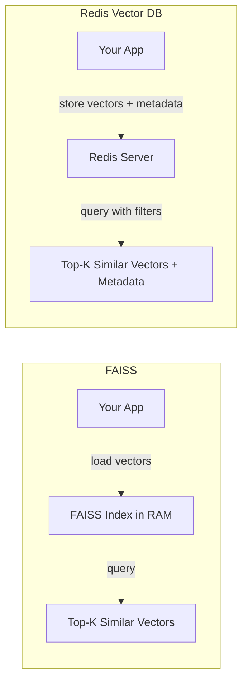
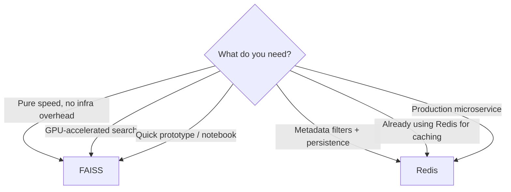
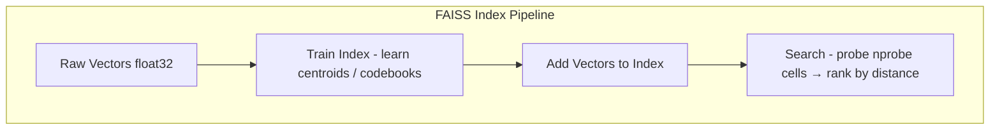
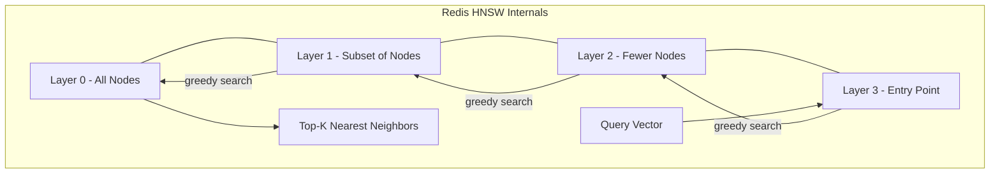
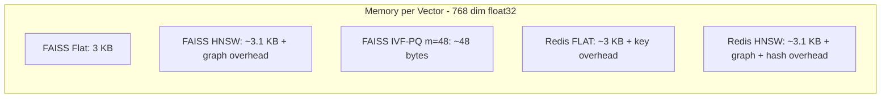
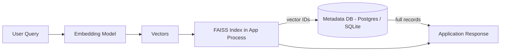
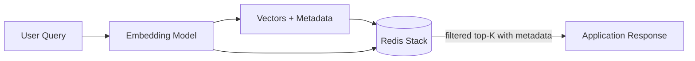

# FAISS vs Redis Vector DB — A Simple Guide

## What is a Vector Database?

A vector database stores data as **vectors** (lists of numbers). These vectors represent things like text, images, or audio in a way that machines can understand and compare. The main job of a vector DB is to find items that are **similar** to a given query — fast.

---

## FAISS (Facebook AI Similarity Search)

FAISS is an open-source library built by Meta (Facebook) for efficient similarity search over large collections of vectors.

- It's a **library**, not a standalone database — you embed it into your Python code.
- Runs entirely **in-memory** (RAM), which makes it blazing fast.
- Great for **offline / batch** workloads or research experiments.
- No built-in persistence — if your app restarts, you need to reload the index from disk yourself.
- No native support for metadata filtering (e.g. "find similar vectors WHERE category = 'sports'").
- Scales vertically — throw more RAM / GPUs at it.

## Redis (with Vector Search)

Redis is a popular in-memory data store that added **vector search** capabilities via the **RediSearch** module (now part of Redis Stack).

- It's a full **database server** — runs as a separate service you connect to.
- Supports vectors **alongside traditional data** (hashes, JSON, strings, etc.).
- Built-in **metadata filtering** — you can combine vector similarity with field-based filters in one query.
- Data is **persisted to disk** automatically (RDB snapshots / AOF).
- Scales horizontally with Redis Cluster.
- Comes with a rich ecosystem: pub/sub, caching, streams, etc.

---

## How They Work (Simplified)



---

## Head-to-Head Comparison

| Feature | FAISS | Redis Vector DB |
|---|---|---|
| Type | Library (embedded) | Database server |
| Speed | Extremely fast (in-process) | Very fast (network call) |
| Persistence | Manual (save/load index files) | Built-in (RDB / AOF) |
| Metadata filtering | Not supported natively | Supported out of the box |
| Scalability | Vertical (more RAM / GPU) | Horizontal (Redis Cluster) |
| Setup complexity | `pip install faiss-cpu` and go | Need Redis Stack running |
| GPU support | Yes | No |
| Best for | Research, batch jobs, pure speed | Production apps, hybrid queries |
| Language support | Python / C++ | Any language with a Redis client |
| Community | Large (ML/AI community) | Large (general dev community) |

---

## When to Pick What?



---

## Indexing Algorithms — Under the Hood

Both FAISS and Redis use specialized data structures to avoid brute-force scanning every vector on each query.

### FAISS Index Types

FAISS offers a family of index types you can mix and match:

| Index | What it does | Trade-off |
|---|---|---|
| `IndexFlatL2` | Exact brute-force search (L2 distance) | 100% recall, slowest |
| `IndexFlatIP` | Exact brute-force search (Inner Product / cosine) | 100% recall, slowest |
| `IndexIVFFlat` | Inverted File Index — partitions vectors into Voronoi cells, searches only nearby cells | Faster, slight recall loss |
| `IndexIVFPQ` | IVF + Product Quantization — compresses vectors into compact codes | Much less RAM, lower recall |
| `IndexHNSWFlat` | Hierarchical Navigable Small World graph | Great recall-speed balance |
| `IndexScalarQuantizer` | Quantizes float32 → int8/int4 | Saves memory, minor recall drop |

You can also compose indexes: e.g. `IndexIVFPQ` wraps an IVF partitioner around PQ-compressed vectors.



**Key parameters:**
- `nlist` — number of Voronoi cells (IVF indexes). Higher = more partitions, faster search, needs more training data.
- `nprobe` — number of cells to visit at query time. Higher = better recall, slower.
- `m` (PQ) — number of sub-quantizers. Higher = better recall, more memory.
- `nbits` (PQ) — bits per sub-quantizer code. Typically 8.

### Redis Vector Search Algorithms

Redis supports two indexing algorithms via the `VECTOR` field type in RediSearch:

| Algorithm | How it works | Best for |
|---|---|---|
| **FLAT** | Brute-force scan over all vectors | Small datasets (< 100K vectors), exact results |
| **HNSW** | Hierarchical Navigable Small World graph | Large datasets, approximate nearest neighbor |

**HNSW parameters in Redis:**
- `M` — number of bi-directional links per node (default 16). Higher = better recall, more memory.
- `EF_CONSTRUCTION` — size of dynamic candidate list during index build (default 200). Higher = better index quality, slower build.
- `EF_RUNTIME` — size of dynamic candidate list during search (default 10). Higher = better recall, slower query.



---

## Distance Metrics

| Metric | Formula (simplified) | Use case |
|---|---|---|
| **L2 (Euclidean)** | `√Σ(aᵢ - bᵢ)²` | General purpose, unnormalized vectors |
| **Inner Product (IP)** | `Σ(aᵢ × bᵢ)` | When vectors are normalized (equivalent to cosine) |
| **Cosine Similarity** | `IP / (‖a‖ × ‖b‖)` | Text embeddings, semantic search |

- FAISS supports L2 and IP natively. For cosine, normalize your vectors first and use IP.
- Redis supports L2, IP, and Cosine as first-class distance metrics — no manual normalization needed.

---

## Code Examples

### FAISS — Build and Query an HNSW Index

```python
import faiss
import numpy as np

dim = 768                          # embedding dimension
n_vectors = 100_000                # number of vectors to index

# generate some random vectors (replace with real embeddings)
vectors = np.random.rand(n_vectors, dim).astype("float32")
faiss.normalize_L2(vectors)        # normalize for cosine similarity

# build HNSW index
index = faiss.IndexHNSWFlat(dim, 32)   # 32 = M (links per node)
index.hnsw.efConstruction = 200        # build-time quality
index.hnsw.efSearch = 64               # query-time quality
index.add(vectors)

# search
query = np.random.rand(1, dim).astype("float32")
faiss.normalize_L2(query)
distances, indices = index.search(query, k=5)

print("Top-5 neighbor IDs:", indices[0])
print("Distances:", distances[0])

# persistence — manual save / load
faiss.write_index(index, "my_index.faiss")
index = faiss.read_index("my_index.faiss")
```

### Redis — Build and Query a Vector Index

```python
import redis
import numpy as np
from redis.commands.search.field import VectorField, TextField, NumericField
from redis.commands.search.indexDefinition import IndexDefinition, IndexType
from redis.commands.search.query import Query

r = redis.Redis(host="localhost", port=6379)

# 1. create index schema
schema = (
    TextField("title"),
    NumericField("year"),
    VectorField("embedding",
        "HNSW", {
            "TYPE": "FLOAT32",
            "DIM": 768,
            "DISTANCE_METRIC": "COSINE",
            "M": 16,
            "EF_CONSTRUCTION": 200,
        }
    ),
)

r.ft("docs_idx").create_index(
    schema,
    definition=IndexDefinition(prefix=["doc:"], index_type=IndexType.HASH)
)

# 2. insert vectors with metadata
for i in range(1000):
    vec = np.random.rand(768).astype("float32").tobytes()
    r.hset(f"doc:{i}", mapping={
        "title": f"Document {i}",
        "year": 2020 + (i % 6),
        "embedding": vec,
    })

# 3. hybrid query — vector similarity + metadata filter
query_vec = np.random.rand(768).astype("float32").tobytes()

q = (
    Query("(@year:[2023 2025])=>[KNN 5 @embedding $vec AS score]")
    .sort_by("score")
    .return_fields("title", "year", "score")
    .dialect(2)
)

results = r.ft("docs_idx").search(q, query_params={"vec": query_vec})
for doc in results.docs:
    print(doc.id, doc.title, doc.year, doc.score)
```

---

## Memory & Performance Characteristics



| Scenario (1M vectors, 768-dim) | FAISS IndexFlatL2 | FAISS HNSW | FAISS IVF-PQ | Redis FLAT | Redis HNSW |
|---|---|---|---|---|---|
| Index build time | ~seconds | ~minutes | ~minutes (train + add) | ~minutes | ~minutes |
| RAM usage | ~3 GB | ~3.5 GB | ~50 MB | ~4 GB | ~4.5 GB |
| Query latency (top-10) | ~10 ms | < 1 ms | < 1 ms | ~15 ms | ~2 ms |
| Recall@10 | 100% | ~99% | ~85-95% | 100% | ~99% |

> Numbers are approximate and depend on hardware, data distribution, and tuning.

---

## Architecture Patterns

### Pattern 1 — FAISS as an Embedded Search Engine



You manage metadata separately. FAISS gives you IDs, you look up the rest.

### Pattern 2 — Redis as a Unified Vector + Data Store



Everything lives in Redis — vectors, metadata, caching, sessions. One hop.

---

## TL;DR

- **FAISS** = lightweight, fast, great for experiments and when you just need raw vector search.
- **Redis Vector DB** = full-featured, production-ready, great when you need persistence, filtering, and a real database behind your vectors.

Pick FAISS when speed and simplicity matter most. Pick Redis when you need a complete, production-grade solution with extras like filtering and persistence baked in.
